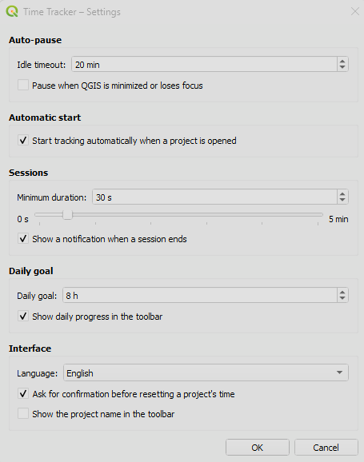

# QGIS Time Tracker Plugin

Track time per QGIS project with automatic persistence, crash recovery, session history, and exports.

The plugin adds a small toolbar to QGIS so you can start, pause, stop, inspect statistics, and configure tracking without leaving the main window.


## What is implemented

- Per-project time tracking with independent totals for each `.qgs` or `.qgz` project
- Start, pause, resume, and stop controls in a dedicated toolbar
- Automatic persistence in SQLite
- Crash recovery based on heartbeat checkpoints
- Tracking for unsaved projects, with migration to the real file path after the first save
- Optional auto-start when a project is opened
- Optional auto-pause after inactivity
- Optional auto-pause when QGIS loses focus or is minimized
- Session history with recovered-session flag
- Summary statistics with KPIs, recent sessions, and activity heatmap
- Project management actions: copy time, reset total, delete project record
- Session management: delete individual sessions and recalculate totals
- CSV and JSON export
- Optional toolbar project name
- Optional daily goal and toolbar progress bar
- Keyboard shortcut: `Ctrl+Alt+T` to start/pause/resume

## Compatibility


- The code includes Qt5/Qt6 compatibility paths and has been tested on both QGIS 3 and QGIS 4. However, compatibility has not yet been extensively validated across different environments and workflows.

## Privacy

All tracked data is stored locally in the user's QGIS profile directory.

The plugin does not transmit, collect, upload, or share any tracking information with external services.

## Installation 

### Install from ZIP

1. Create a ZIP containing the `qgis_time_tracker/` folder.
2. In QGIS, open `Plugins > Manage and Install Plugins > Install from ZIP`.
3. Select the ZIP file.
4. Install and enable the plugin.

### Manual install

Copy `qgis_time_tracker/` into your QGIS plugins directory:

| OS | Default path |
|---|---|
| Linux | `~/.local/share/QGIS/QGIS3/profiles/default/python/plugins/` |
| macOS | `~/Library/Application Support/QGIS/QGIS3/profiles/default/python/plugins/` |
| Windows | `%APPDATA%\QGIS\QGIS3\profiles\default\python\plugins\` |

Then restart QGIS and enable the plugin in `Plugins > Manage and Install Plugins`.

## Toolbar workflow

The toolbar provides:

- `▶` start or resume tracking
- `⏸` pause tracking
- `⏹` stop tracking
- `📊` open statistics
- `⚙` open settings

The timer label supports a context menu to copy the current time and access quick start/pause/stop actions.

If enabled in settings, the toolbar can also show:

- the current project name
- a daily progress bar under the timer

## Settings

The settings dialog currently supports:

- idle timeout in minutes, including disabled mode
- pause on focus loss or minimize
- auto-start when opening a project
- minimum session duration setting
- notification when a session ends
- daily work goal in hours
- show daily progress bar in toolbar
- confirm-before-reset preference
- show project name in toolbar



## Statistics and data management

The statistics dialog has three tabs:

### Summary

- Today, This Week, All Time, Day Streak, and Projects KPIs
- activity heatmap for the last 12 weeks
- recent sessions list

### Projects

- filter by project name or path
- inspect total time, session count, and last access
- copy tracked time to the clipboard
- reset a project's total time
- delete a project's record and all of its sessions

### Session History

- browse recorded sessions across projects
- see recovered sessions flagged in the table
- delete individual sessions

The dialog also supports exporting tracked data to CSV or JSON.

## Data storage

All data is stored in a SQLite database under the QGIS profile directory:

```text
{QGIS profile dir}/time_tracker/time_tracker.db
```

The database schema includes:

- `projects`: cumulative total per project
- `sessions`: individual tracked sessions
- `active_session`: the currently running session used for crash recovery
- `daily_totals`: aggregated daily totals used by the summary views

SQLite is opened with:

- `WAL` journal mode
- foreign keys enabled
- `synchronous=NORMAL`

## Crash recovery behavior

- While tracking is running, the plugin updates a heartbeat every 5 seconds.
- If QGIS crashes, the plugin recovers the last active session from the saved heartbeat on the next startup.
- Recovered sessions are marked in session history and in the recent sessions summary.

In practice, this means a crash should lose at most about 5 seconds of tracked time.

## Unsaved projects

Unsaved projects are tracked under an internal `__unsaved__` key.

When the project is saved for the first time, the plugin migrates accumulated totals and session history to the real project path so the tracked data is preserved.

## Export formats

### CSV

Exports one row per project with:

- `project_name`
- `project_path`
- `total_seconds`
- `total_time_hms`
- `session_count`
- `last_accessed`

### JSON

Exports the same project-level fields plus nested session history for each project:

- `start_time`
- `end_time`
- `duration_seconds`
- `recovered`

## Current limitations

- There are no automated tests in this repository yet.
- Daily totals are keyed by the session start date, so sessions spanning midnight are not split across two calendar days.
- The `Minimum session duration` setting is exposed in the UI, but the current implementation still persists short sessions instead of discarding them.
- The `confirm before resetting` preference is exposed in settings, but reset actions currently still ask for confirmation.


## License

See [qgis_time_tracker/LICENSE](qgis_time_tracker/LICENSE).
